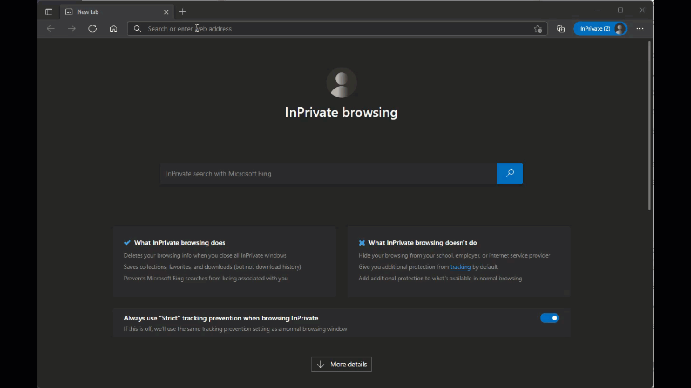

# Listen to a Talk Group

To listen to a specific talk group from the last heard dashboard, watch the view below _(click on the video to see larger version)_ or scroll down to the steps section.&#x20;

### Step by Step

1. Go to https://brandmeister.network
2. Click on the "Last Heard" link on the left menu.
3. Click the Pause Button to freeze the last heard (Optional, this helps so the page does not keep scrolling in order to allow you to click on the live icon)
4. Click on the Audio icon next to the talk group in the destination column you wish to listen to.
5. This will open a new screen to the hose.brandmeister.network site.
6. Notice in the player at top right it now has the talk group listed and should begin to hear conversations on the selected talk group.
7. Enjoy.&#x20;
