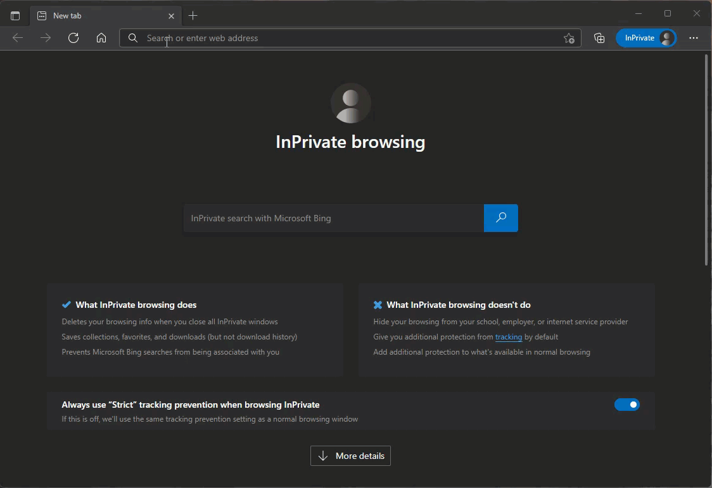

# Talk Group Last Heard

To view the last heard for a specific talk group watch _(click on video below for larger version)_ the view below or scroll down to the steps section.&#x20;

### Step by Step

1. Go to [https://brandmeister.network](https://brandmeister.network)
2. Click on "Last Heard" link on the left menu.
3. Click the "+" link at the top right in the search section.
4. Click "Add Rule" button.
5. In the drop down select "Destination ID"
6. Enter the Talk Group ID. (you will need to enter the TG ID, there is no dropdown to select from).
7. Click the "Search" button.
8. The last heard for the specific group will now start to display.&#x20;
9. Enjoy!
