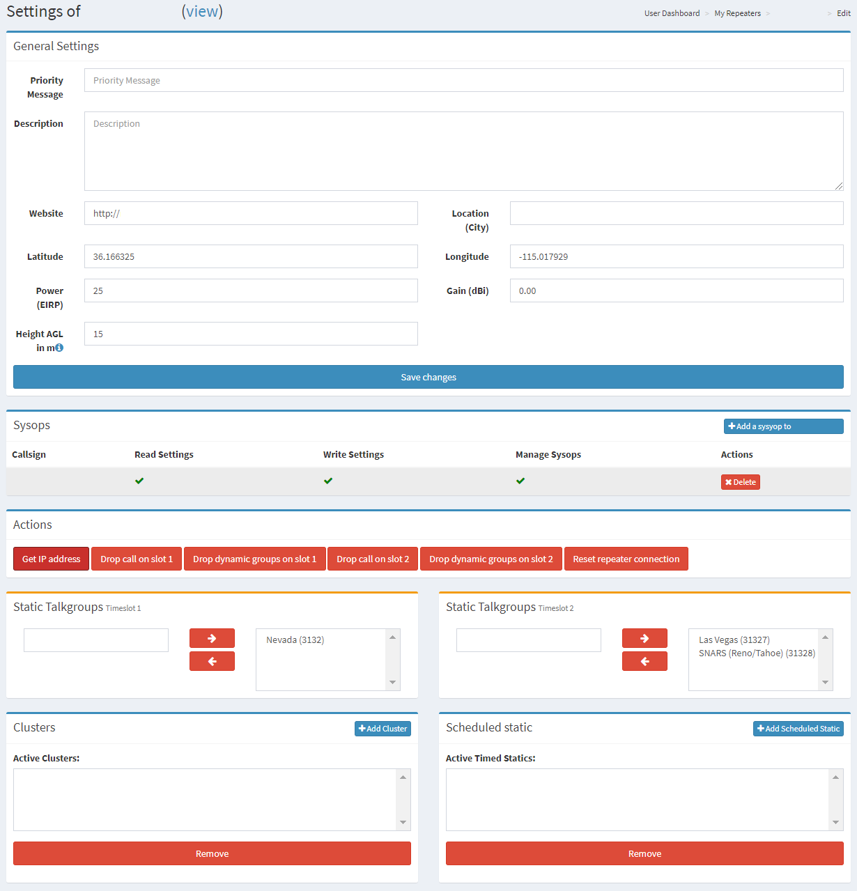

# Sysop Dashboard

The dashboard is designed for repeater sysops connecting to BrandMeister a method to make configuration settings and manage connections as needed.&#x20;

**SYSOP Access:** RadioID.net now sends repeater IDs to BrandMeister every 5 to 10  minutes. This means once you register for a Repeater ID on RadioID.net it will appear under the My Devices section on the dashboard and assigns sysop rights to the listed trustee. Please make sure on RadioID.net to set the Repeater Status to On-Air/Visible for the RepeaterID on RadioID, otherwise it won't update to BrandMeister. This only works for those who have a registered BrandMeister Account. If you dont have one please create one by going to [Register for an Account](../../dashboard/register-for-an-account.md).

The following sections will provide information on each section for sysops to review and manage.


[general-settings.md](general-settings.md)



[static-talkgroups.md](static-talkgroups.md)



[scheduled-talkgroups.md](scheduled-talkgroups.md)



[clusters.md](clusters.md)



[actions.md](actions.md)



[sysops.md](sysops.md)



[frequency-details.md](frequency-details.md)


