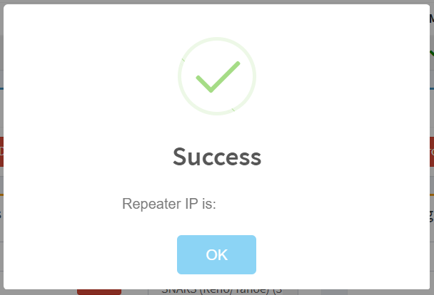

# Actions

.png>)

## Get IP Address

This provides for an easy way to see the IP Address your repeater is using / connecting to the BrandMeister Server. This may also provide a verification your repeater is connecting properly.&#x20;

## Drop Call on Slot 1 or Slot 2

This allows the sysop to drop a call on the select timeslot due to possible locked keyup by the user or for other reasons.

.png>)

## Drop Dynamic Group on Slot 1 or Slot 2

This allows the sysop to drop all dynamic calls activated by users on the repeater. This will drop only dynamic talk groups and will not affect the statics if there are any assigned to the timeslot.&#x20;

.png>)

## Reset Repeater Connection

This allows the sysop to reset the connection of the repeater. This could help to resolve a stale IP address or for other reasons. This will trigger the repeater to essentially login in to the master server.  Typically the repeater will reconnect within seconds.&#x20;

.png>)
