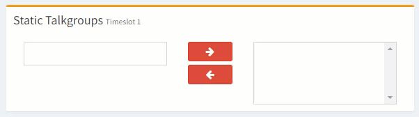
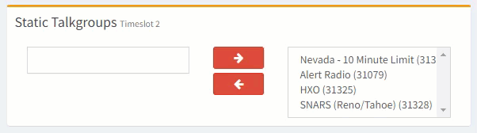

# Static Talk Groups

Static talk groups allow for specific talk groups to be set static/active meaning any traffic which becomes available will be sent to the repeater. Be careful of not adding to many static talk group for your users as they might at time cause some busy talk groups to monopolize the repeater/timeslot with traffic. A good general number is 3 or less static talk groups. Some users will dedicate Timeslot 2 to only 1 or 2 statics and might place most of other statics on Timeslot 1.

.png>)

## Add a Static Talk Group

1.) In the text box with in the Static Talk groups box (Timeslot 1 or Timeslot 2) enter the talk group ID as the example shows below.\
\

2.) Click the first button (pointing right) to add the talk group to set as static.

3.) Repeat the steps for the number of talk groups you wish to add in the timeslot 1 or timeslot 2 sections.

## Remove Static Talk Group

1.) in the list box of the respective Timeslot in the Static Talk Group section select the talk group you wish to remove.

2.) Click the second button (pointing to the left) to remove the selected talk group (notice the grey when selecting a talk group to remove as this indicates the talk group selected).

3.) Repeat the steps above for any other talk groups you wish to remove from being static.&#x20;
